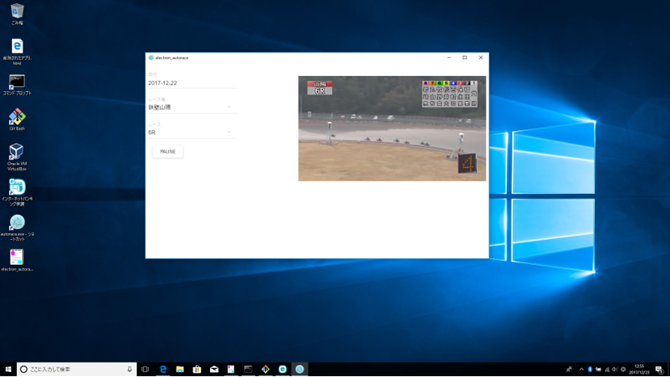

# electron_autorace
- [Electron](https://electronjs.org/)を利用して作った[オートレース](http://autorace.jp/)の過去動画を再生するアプリです
- Windows, Macで動作します



# Requirements
- [Node.js](https://nodejs.org/ja/)

# 使い方
```
$ npm install --global yarn
$ git clone https://github.com/TORIFUKUKaiou/electron_autorace.git
$ cd electron_autorace
$ yarn
$ yarn run build
$ yarn run start
```
# 実行ファイルの作り方
```
$ npm install --global asar
$ npm install --global electron-packager
$ yarn run build
$ asar pack ./out ./autorace.asar

[Windows]
$ electron-packager ./ autorace --platform=win32 --arch=x64
[Mac]
$ electron-packager ./ autorace --platform=darwin --arch=x64
```
- Windows => electron_autorace\autorace-win32-x64\autorace.exe
- Mac => electron_autorace/autorace-darwin-x64/autorace.app
